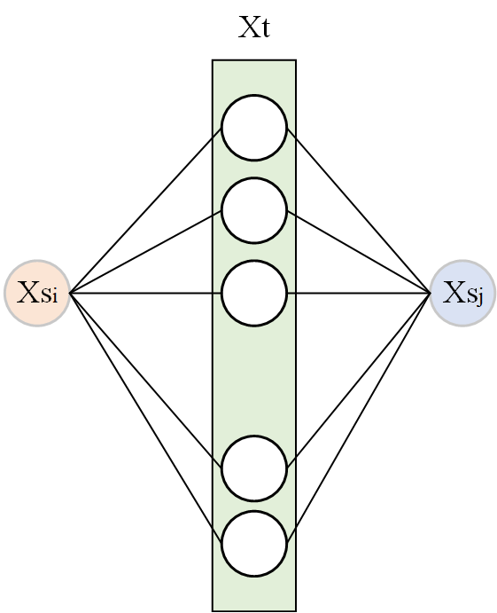

利用Tss（源域之间的真实关系）和Tsts（通过目标域建立的源域之间的关系）对Wst进行修正。

其中
$$
{\Large
\mathbf{T}_{ss}^{i j}=\left\{\begin{array}{ll}
\frac{1}{n_{s}^{c}} & \mathbf{x}_{i}^{s}, \mathbf{x}_{j}^{s} \in \Omega_{c} \\
0 & \text { else }
\end{array}\right.
}  \tag1
$$

$$
{\Large
\left|{{T}_{ss}-W_{st}W_{ts}} \right | = 0
}\tag2
$$

$$
{\Large
T_{sts} = W_{st}W_{ts}
}   \tag3
$$

有以下几个问题：

- Tsts值的大小与目标域各类数据点的个数有关，无法与Tss进行比较；（使用伪标签）
- 比较Tsts和Tss的值，若不满足式(2)，则说明Xsi或Xsj与目标域数据点的关系有错误，需要断掉Xsi或Xsj与Xt之间的连接。

