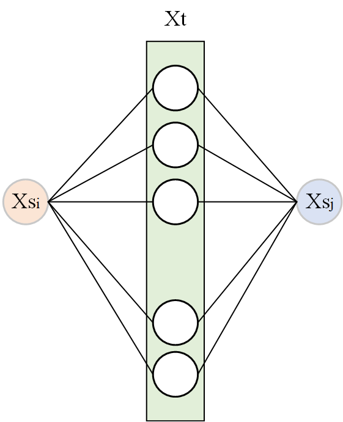

利用Tss（源域之间的真实关系）和Tsts（通过目标域建立的源域之间的关系）对Wst进行修正。

其中
$$
{\Large
\mathbf{T}_{ss}^{i j}=\left\{\begin{array}{ll}
\frac{1}{n_{s}^{c}} & \mathbf{x}_{i}^{s}, \mathbf{x}_{j}^{s} \in \Omega_{c} \\
0 & \text { else }
\end{array}\right.
}  \tag1
$$

$$
{\Large
\left|{{T}_{ss}-W_{st}W_{ts}} \right | = 0
}\tag2
$$

$$
{\Large
T_{sts} = W_{st}W_{ts}
}   \tag3
$$

有以下几个问题：

- Tsts值的大小与目标域各类数据点的个数有关，无法与Tss进行比较；（使用伪标签）
- 比较Tsts和Tss的值，若不满足式(2)，则说明Xsi或Xsj与目标域数据点的关系有错误，需要断掉Xsi或Xsj与Xt之间的连接。

做了以下几个事情：

1. 如何判断${\large T_{ss}^{ij}}$与${\large T_{sts}^{ij}}$的大小

   根据公式(3)可知，${\large T_{sts}^{ij}=W_{st}^{i,:}{\cdot}W_{ts}^{:,j}}$，其中${\large T_{sts}^{ij}}$值的大小与目标域各类数据点的个数有关，无法与Tss进行比较；（使用目标域伪标签）

2. 通过比较${T}_{ss}$与$W_{st}\cdot W_{ts}$的关系

   当${{T}_{ss}-W_{st}\cdot W_{ts}}<0$时，表示源域两个点不同类别（实际），但是通过目标域计算的两个点的关系却认为其是同一类别的，说明其中至少有一个点是错误的。

3. 找出2中的情况后，如何去掉源域数据点$X_s^i$与目标域数据点$X_t$的连接

   统计每个点被认为错误的次数，超过一个阈值，则断开$X_s^i$与$X_t$的连接（怎样的连接？）。

4. Progressive Feature Alignment for Unsupervised Domain Adaptation

- 计算源域各类类心，根据目标域每个点与源域各类类心之间的相似性程度来判断目标域数据点的类别（得到目标域数据点的伪标签）。

